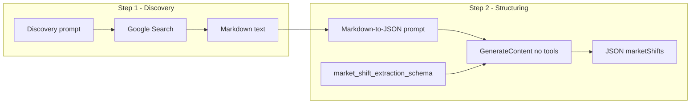

# Market shifts: two-step extraction (discover in markdown, then structured JSON)

## Why

Gemini does not allow **tool use (Google Search)** together with **response_mime_type: application/json** (structured output). So we split into:

- **Step 1**: Grounded search → output in **markdown** (tools allowed, no schema).
- **Step 2**: No tools → take markdown as input, produce **structured JSON** (schema allowed).

## Architecture

## Step 1 – Discovery (markdown)

- **Goal**: Use Google Search to find recent financial news and list candidate market shifts. Output format: **markdown only** (no JSON).
- **Prompt**: New file `functions_macro/prompts/market_shift_discovery_prompt.txt`.
  - Same task and rules as current extraction (causes not effects, date window, categories, channels, status, article refs).
  - Ask for a **markdown document** with one block per shift. Each block must include: type, category, headline, summary, channelIds, status, and article refs (url, title, source, publishedAt). Use clear headings/labels so step 2 can parse (e.g. `## Shift`, `**Headline**: ...`, or a simple bullet list with fixed field names).
- **Code**: New function `fetch_market_shifts_markdown(prompt: str, verbose: bool = False) -> tuple[str, dict]`. Same as current grounded call but **no** `response_mime_type` / `response_json_schema`. Return `(response.text, usage)`.
- **Config**: `tools=[Google Search]`, `automatic_function_calling`, temperature/max_tokens. No schema.

## Step 2 – Markdown → structured JSON

- **Goal**: Convert the step-1 markdown into JSON that matches the existing `market_shift_extraction_schema.json`.
- **Prompt**: New file `functions_macro/prompts/market_shift_markdown_to_json_prompt.txt`.
  - Single placeholder: `{markdown_content}`.
  - Instruction: "Convert the following markdown list of market shifts into a single JSON object with key `marketShifts` (array of objects). Each object must have: type, category, headline, summary, channelIds (array), status, articleRefs (array of { url, title, source, publishedAt }). Use only the categories and channel enums listed in the schema. Output nothing but valid JSON."
- **Code**: New function `markdown_to_market_shifts_json(markdown: str, client, verbose: bool = False) -> tuple[list[dict], dict]`.
  - Load prompt template with `markdown_content=markdown`.
  - Load and clean `market_shift_extraction_schema.json` via extraction_utils.
  - Config: **no tools**, `response_mime_type="application/json"`, `response_json_schema=cleaned_schema`.
  - `response = client.models.generate_content(...)` then `data = json.loads(response.text)`, return `(data["marketShifts"], usage)`.
- **Config**: No tools; temperature/max_tokens; structured output only.

## Orchestration in scan_market_shifts.py

- **Replace** the current `fetch_market_shifts` implementation (and remove `_parse_json_from_response_text` usage for this flow) with:
  1. Build discovery prompt with `load_prompt_template("market_shift_discovery_prompt.txt", prompts_dir=PROMPTS_DIR, current_date=..., cutoff_date=...)`.
  2. `markdown_text, usage1 = fetch_market_shifts_markdown(prompt, verbose)`.
  3. `market_shifts, usage2 = markdown_to_market_shifts_json(markdown_text, client, verbose)` (use same `client = get_genai_client()`).
  4. `_add_usage(usage1, usage2)` and return `(market_shifts, combined_usage)`.
- **Keep** `_parse_json_from_response_text` and `extract_json_from_llm_response` for **timeline** (and any other path that still uses tools + free-form response). Step 2 always returns pure JSON, so `json.loads(response.text)` is enough there.
- **Optional**: If step 2 fails (empty or invalid JSON), log and optionally retry once or return empty list plus usage.

## File summary

| Action | File |
|--------|------|
| Add | `functions_macro/prompts/market_shift_discovery_prompt.txt` – same task as current extraction, output = markdown with one block per shift and clear field labels. |
| Add | `functions_macro/prompts/market_shift_markdown_to_json_prompt.txt` – "Convert the following markdown to JSON" with `{markdown_content}`. |
| Edit | `functions_macro/market_shifts/scan_market_shifts.py` – add `fetch_market_shifts_markdown`, add `markdown_to_market_shifts_json`; change `fetch_market_shifts` to run step 1 then step 2 and combine usage. |

## Prompt design details

- **Discovery prompt**: Reuse the current date/cutoff, cause-vs-effect rules, category and channel enums, and articleRefs requirement. Replace the final "Return your response as valid JSON…" with: "Return your response in **markdown**. For each market shift use a clear heading (e.g. ## or ###) and list: Type, Category, Headline, Summary, Channel IDs, Status, and Article refs (each with url, title, source, publishedAt). So the next stage can convert this to JSON without ambiguity."
- **Markdown-to-JSON prompt**: Short. "You are given a markdown document listing market shifts. Convert it to a single JSON object: `{ \"marketShifts\": [ ... ] }`. Each element must have type, category, headline, summary, channelIds (array of strings), status, articleRefs (array of objects with url, title, source, publishedAt). Use only the category and channel values from the list below. Output only valid JSON, no other text." Then inject `{markdown_content}`. Schema is enforced by API; the prompt is for clarity.

## Timeline and summary (unchanged)

- **fetch_shift_timeline**: Still uses Google Search + free-form response; keep current implementation (no structured output, parse with `_parse_json_from_response_text`).
- **fetch_market_summary**: No tools; keep structured output and schema as-is.

## Backward compatibility

- Downstream (normalize_shift, save_market_shifts, Firestore) still receive the same list of shift dicts. Only the way we obtain that list changes (two API calls instead of one, with markdown as an intermediate format).
